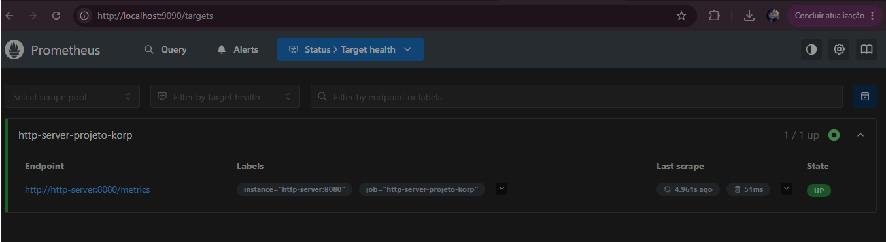
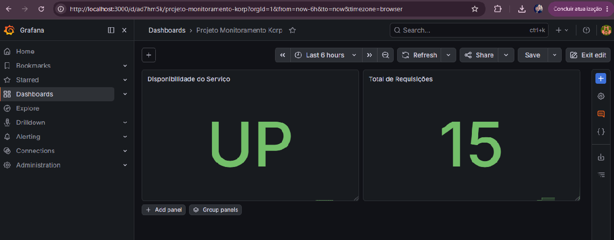

# http-server-projeto-korp

Projeto desenvolvido como parte do desafio técnico da Korp.

## Objetivo

Implementar um serviço HTTP em Golang executado em containers Docker, utilizando NGINX como proxy reverso, Prometheus para monitoramento, Grafana para visualização de métricas e Ansible para automação do provisionamento.

---

## Tecnologias Utilizadas

* Golang
* Docker
* Docker Compose
* NGINX
* Prometheus
* Grafana
* Ansible

---

## Pré-requisitos

Antes de executar o projeto, é necessário possuir:

- Docker
- Docker Compose
- Ansible

Instale a collection utilizada pelo playbook:

```bash
ansible-galaxy collection install community.docker
```

Verifique a instalação:

```bash
ansible-galaxy collection list | grep community.docker
```
---

## Arquitetura

```text
Cliente
   |
   v
NGINX (porta 80)
   |
   v
Aplicação Go (porta 8080)
   |
   +--> /health
   |
   +--> /metrics
           |
           v
      Prometheus
           |
           v
        Grafana
```
---

## Funcionalidades

### Endpoint principal

GET `/projeto-korp`

Exemplo de resposta:

```json
{
  "nome": "Projeto Korp",
  "horario": "2026-06-08T11:29:12Z"
}
```

O campo `horario` é gerado dinamicamente em UTC a cada requisição.

### Endpoint de Health Check

O endpoint `/health` foi implementado para validação de disponibilidade da aplicação.

Ele pode ser utilizado por ferramentas de monitoramento, balanceadores de carga ou automações para verificar se o serviço está operacional.

GET `/health`

Resposta:

```json
{
  "status": "UP"
}
```

### Endpoint de Métricas

GET `/metrics`

Métricas expostas no padrão Prometheus.

---

## Métricas Implementadas

### Disponibilidade do Serviço

```promql
service_up
```

### Volume de Requisições

```promql
http_requests_total
```

---

## Estrutura do Projeto

```text
.
├── ansible
├── docs
│   ├── prometheus.png
│   └── grafana.png
├── grafana
│   └── dashboard.json
├── nginx
├── prometheus
├── Dockerfile
├── docker-compose.yml
├── main.go
└── README.md
```

---

## Dockerfile

A aplicação utiliza multi-stage build para reduzir o tamanho da imagem final.

Etapas:

1. Compilação da aplicação utilizando a imagem oficial do Golang.
2. Geração do binário estático.
3. Criação de uma imagem final baseada em Alpine Linux contendo apenas o binário da aplicação.

Benefícios:

- Imagem menor
- Menor superfície de ataque
- Build mais eficiente
- Melhor prática para aplicações Go em containers

---

## Executando com Docker Compose

### Build e inicialização

```bash
docker compose up -d --build
```

### Verificar containers

```bash
docker ps
```

### Testar aplicação

```bash
curl http://localhost/projeto-korp
```

### Testar Health Check

```bash
curl http://localhost/health
```

### Testar métricas

```bash
curl http://localhost/metrics
```

---

## Monitoramento

### Prometheus

Acesse:

http://localhost:9090

Verifique os targets em:

Status → Targets

O serviço deve aparecer com status UP.

Exemplo:



## Grafana

### Dashboard de Exemplo

O projeto disponibiliza um dashboard exportado:

```text
grafana/dashboard.json
```

Para importar:

- Dashboards → Import
- Selecionar o arquivo `grafana/dashboard.json`

Acessar:

```text
http://localhost:3000
``

Login padrão:

```text
Usuário: admin
Senha: admin
```

Dashboard configurado para exibir:

Disponibilidade do serviço (service_up)
Total de requisições (http_requests_total)

## Configuração do Grafana

Após o primeiro acesso é necessário configurar o datasource do Prometheus.

Menu:

Connections → Data Sources

Selecionar:

Prometheus

URL utilizada pelo datasource do Grafana:git 

http://prometheus:9090

Salvar em:

Save & Test

Exemplo:



---

## Queries Utilizadas

Disponibilidade do serviço:

```promql
service_up
```

Total de requisições:

```promql
http_requests_total
```

## Automação com Ansible

Para provisionar o ambiente:

```bash
ansible-playbook -i ansible/inventory.ini ansible/playbook.yml
```

O playbook realiza:

* Verificação do Docker
* Criação da rede Docker
* Build da aplicação
* Inicialização dos containers
* Configuração do proxy reverso
* Inicialização do Prometheus
* Inicialização do Grafana
* Validação do endpoint HTTP
* Exibição da resposta no terminal

O playbook utiliza a collection `community.docker` para gerenciamento da rede Docker.

Executar:

```bash
ansible-playbook -i ansible/inventory.ini ansible/playbook.yml
```

---

## Teste Esperado

Após a execução do ambiente:

```bash
curl http://localhost/projeto-korp
```

Resposta esperada:

```json
{
  "nome": "Projeto Korp",
  "horario": "<horário UTC atual>"
}
```